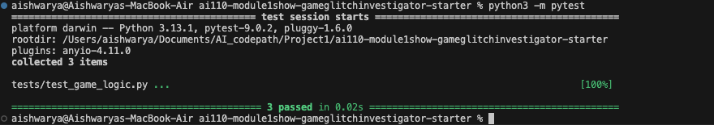

# 🎮 Game Glitch Investigator: The Impossible Guesser

## 🚨 The Situation

You asked an AI to build a simple "Number Guessing Game" using Streamlit.
It wrote the code, ran away, and now the game is unplayable. 

- You can't win.
- The hints lie to you.
- The secret number seems to have commitment issues.

## 🛠️ Setup

1. Install dependencies: `pip install -r requirements.txt`
2. Run the broken app: `python -m streamlit run app.py`

## 🕵️‍♂️ Your Mission

1. **Play the game.** Open the "Developer Debug Info" tab in the app to see the secret number. Try to win.
2. **Find the State Bug.** Why does the secret number change every time you click "Submit"? Ask ChatGPT: *"How do I keep a variable from resetting in Streamlit when I click a button?"*
3. **Fix the Logic.** The hints ("Higher/Lower") are wrong. Fix them.
4. **Refactor & Test.** - Move the logic into `logic_utils.py`.
   - Run `pytest` in your terminal.
   - Keep fixing until all tests pass!

## 📝 Document Your Experience

- [x] **Game Purpose:** A Streamlit-based number guessing game where players try to guess a secret number with hints.
- [x] **Bugs Found:** 
   - State management issue: secret number reset on every button click
   - Reversed hint logic in `check_guess()`: when the guess was higher than the secret number, the hint incorrectly suggested guessing higher instead of lower
- [x] **Fixes Applied:**
   - Implemented Streamlit session state to persist the secret number across interactions
   - Corrected the comparison logic in `check_guess()` function
   - Refactored game logic into `logic_utils.py` for modularity and testability
   - Created comprehensive pytest tests in `tests/test_game_logic.py`
   - Verified all tests pass with `python3 -m pytest`
   - Validated hint system accuracy through manual gameplay testing

## 📸 Demo

This section showcases the Streamlit-based number guessing game application. The game features a fully debugged and refactored codebase that correctly handles guess evaluation and hint generation.

### Running the Application

To launch the game locally, execute the following command in your terminal:

- [ ] [Insert a screenshot of your fixed, winning game here]

## 🚀 Stretch Features

- [ ] [If you choose to complete Challenge 4, insert a screenshot of your Enhanced Game UI here]

## Test Results

All tests passed successfully.

